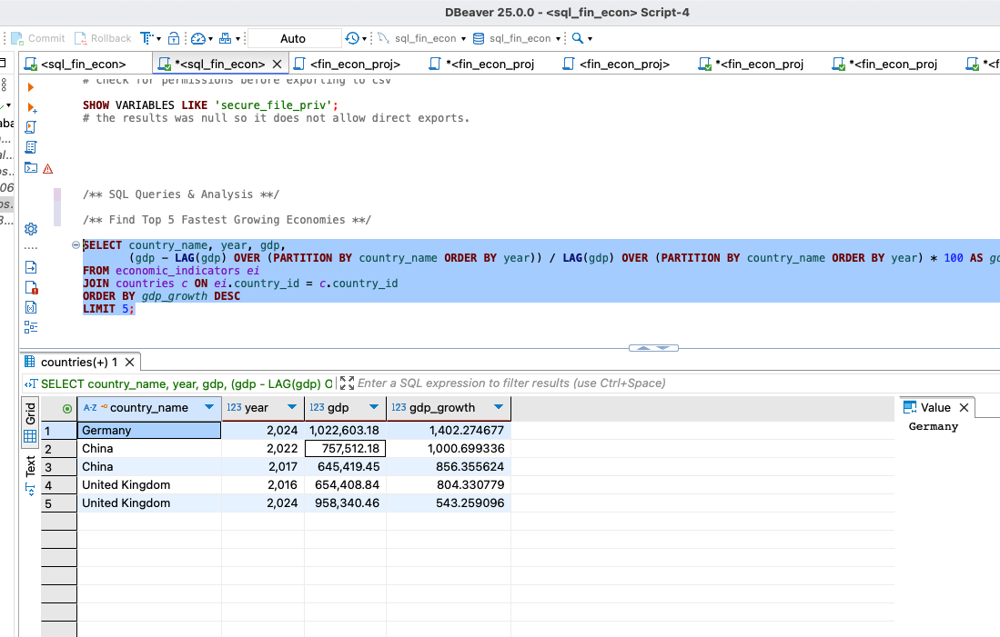

# 🌍 Global Economic and Financial Analytics

## Features
- **Synthetic Data Generation**: SQL scripts to create and populate financial table

## 📌 Overview
This project analyzes **global economic indicators, financial markets, and stock performance** using **SQL**. The database is structured with multiple interconnected tables to model financial data efficiently, enabling insights through advanced SQL queries.




## Folder and File Structure 
- **tables.sql** This file produces the tables for the sql analysis. 
- **main.sql** This contains all the sql structure functions to create the queries. Thus, generating the synthetic data for the tables and sql dataset. 
- **/Screenshots** This folder contains all the screenshots that were taken during the sql operations and functionalities. Thus, the creation of new tables, inserting and analysis. 

## 📊 Database Schema
The database consists of multiple tables covering:
- **Countries** 🌎 *(GDP, inflation, unemployment, trade balance, etc.)*
- **Stock Markets** 📈 *(Index performance, volatility, trading volume, etc.)*
- **Currencies** 💱 *(Exchange rates, currency reserves, stability metrics, etc.)*
- **Interest Rates** 📉 *(Central bank rates, bond yields, etc.)*
- **Economic Indicators** 📊 *(Consumer spending, industrial production, etc.)*

### **Entity-Relationship Diagram (ERD)**
📌 *(Include an ERD image or schema diagram here)*

## 🛠️ Setup & Installation
1️⃣ **Clone the Repository:**
```bash
git clone https://github.com/kw3ku/Sql-global-economic-financial-analytics.git
cd Sql-global-economic-financial-analytics
```
2️⃣ **Import the Database in DBeaver:**
- Open DBeaver
- Connect to your SQL database (PostgreSQL/MySQL/SQLite)
- Run the SQL scripts in `/schema/`

3️⃣ **Insert Sample Data:**
```sql

-- Example: Table structure
CREATE TABLE economic_indicators (
    indicator_id SERIAL PRIMARY KEY,
    country_id INT REFERENCES countries(country_id),
    year INT NOT NULL,
    gdp NUMERIC(15,2),
    inflation_rate NUMERIC(5,2),
    trade_balance NUMERIC(15,2),
    UNIQUE (country_id, year)
);

CREATE TABLE exchange_rates (
    rate_id SERIAL PRIMARY KEY,
    country_id INT REFERENCES countries(country_id),
    currency_code CHAR(3) NOT NULL,
    year INT NOT NULL,
    exchange_rate NUMERIC(10,4),
    UNIQUE (country_id, currency_code, year)
);

-- Example: Insert sample GDP data
INSERT INTO Countries (id, name, gdp, inflation, unemployment_rate) VALUES
(1, 'USA', 25000000, 3.2, 4.1),
(2, 'Germany', 4200000, 2.8, 3.5),
(3, 'Japan', 5100000, 1.1, 2.9);

```

## 🔍 Key SQL Queries
✅ **Find Top 5 Countries by GDP:**
```sql
SELECT name, gdp FROM Countries ORDER BY gdp DESC LIMIT 5;
```
✅ **Track Stock Market Trends Over Time:**
```sql
SELECT country_id, year, avg(stock_index) FROM StockMarkets GROUP BY country_id, year ORDER BY year DESC;
```
✅ **Analyze Inflation Impact on Interest Rates:**
```sql
SELECT c.name, e.inflation, i.interest_rate 
FROM Countries c
JOIN EconomicIndicators e ON c.id = e.country_id
JOIN InterestRates i ON c.id = i.country_id
ORDER BY e.inflation DESC;
```

## 📈 Insights & Findings
📌 *Summarize key insights here, e.g.,*
- Countries with **higher inflation** tend to have **higher interest rates**.
- Stock market **volatility increases** during financial crises.
- Strong **foreign reserves** help stabilize currency fluctuations.

## 🔥 Future Enhancements
- Integrate **real-world financial APIs** (e.g., World Bank, Yahoo Finance)
- Implement **visualizations using Python/Power BI**
- Optimize SQL queries for **faster performance**

## 📜 License
This project is **open-source** under the MIT License.

---
🚀 **Contributions are welcome!** If you have suggestions or improvements, feel free to **fork** and create a **pull request**! 🔥